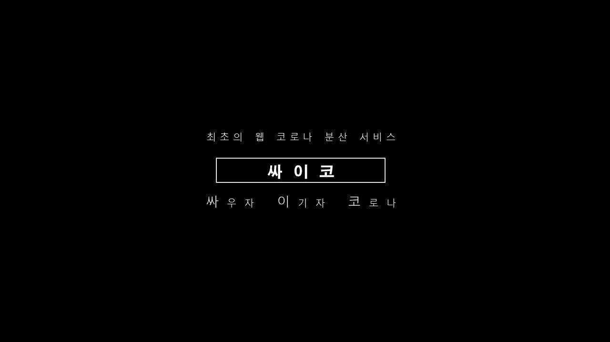

# 싸이코 (싸우자 이기자 코로나)

[**notion 프로젝트 내용 보러가기**](https://www.notion.so/COSAT-98905101fd0740808ed67f1c3551bfa9 "notion으로 이동")  
[**git flow reference**](https://k39335.tistory.com/82 "gitflow 참고")

### **SSAFY Bigdata project [made by COSAT]**

 

## 목차

- [개요](#개요)
- [기능](#기능)
- [유사 서비스](#유사-서비스)
- [향후 전망](#향후-전망)
- [기술 스택](#기술-스택)
- [기술 설명](#기술-설명)
  - [ERD](#erd)
  - [디렉토리 구조도](#디렉토리-구조도)
  - [기타](#기타)
- [테스트 방법](#테스트-방법)

## 개요

> 코로나 시대에 들어서면서 다수의 유동인구를 통한 감염병의 전파가 이슈가 되었습니다. 최대한 이동을 자제하는 것이 이상적이나 서로의 목적에 의해 이동은 불가피합니다. 그로인해 우리는 유동인구를 분산시키기 위한 코로나 예방 서비스를 만들고자 "싸이코" 프로젝트를 개발하게 되었습니다.

## 기능

> 프로젝트의 기능들을 설명해주세요  
> 스크린샷이나 gif등으로 한눈에 볼 수 있게 하면 더 좋습니다

## 유사 서비스

> 프로젝트와 유사한 서비스들이 있다면 소개해 주고 여러분의 프로젝트 만의 차이점을 기술해주세요

## 향후 전망

> 부득이한 사정으로 프로젝트에 구현하지는 못했지만 보완할 점이나 추가할 점이 있다면 적어주세요

## 기술 스택

> 프로젝트를 구현 할 때 사용한 기술들을 적어주세요

## 기술 설명

### ERD

> DB 및 백엔드를 구현할 때 ERD를 그려보고 리드미에 남겨주세요

### 디렉토리 구조도

> 폴더 구조가 어떻게 되는지 폴더, 파일별 역할들을 간략하게 적어주세요  
> 너무 자세히 적을 필요는 없습니다

### 기타

> 이외에도 프로젝트를 이해하기 위해 필요한 것들을 적어주세요 (팀별 개발표준, API Documentation 등등...)

## 테스트 방법

> 프로젝트를 배포한 url과 테스트하기 위한 계정 ID/PW를 적어주세요

---

## Memo

협업필터링(CF) - 사용자 행동기록 활용
콘텐츠 기반 필터링(CB) - 항목 자체를 분석

_ensemble system_

하이퍼 파라미터 최적화 방법

- TPE 알고리즘
- HyperOpt 알고리즘
- HyperBand 알고리즘

가중합이 잘 동작하지 않는 경우
(in 정보검색)

- 순위 결합(rank aggregation) 알고리즘
  - 상호 랭킹 결합
  - comb mnz

새로운 로직의 성능 측정

가장 간단한 측정법 : 전후 비교법

- 이 방법은 공정하지 않음(변수)

  - 온라인 테스트를 통해 지표 측정 방법론이 공정함
